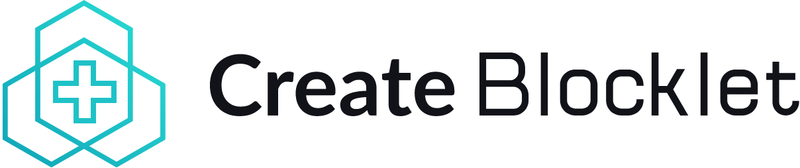

<div align="center">
  

  <p><strong>The fastest way to create modern blocklet applications</strong></p>

  <p>
    <a href="https://www.createblocklet.dev">📚 Documentation</a> •
    <a href="https://github.com/blocklet/create-blocklet/issues">🐛 Issues</a> •
    <a href="https://github.com/blocklet/create-blocklet/discussions">💬 Discussions</a>
  </p>

  <p>
    
    
    
  </p>
</div>

---

## ✨ Features

- 🚀 **Quick Setup** - Get started in seconds with a single command
- 🎯 **Multiple Templates** - Choose from 20+ production-ready templates
- 🔧 **Framework Agnostic** - Support for React, Vue, Svelte, SolidJS, and more
- 🌐 **Full-Stack Ready** - Templates for dApps, static sites, and APIs
- 📦 **Modern Tooling** - Built with Vite, TypeScript, and modern build tools
- 🔒 **DID Integration** - Built-in support for decentralized identity
- 🎨 **Customizable** - Easy to extend and customize for your needs

## 🚀 Quick Start

```bash
# Create a new blocklet project
npx create-blocklet my-blocklet

# Or use your preferred package manager
pnpm create blocklet my-blocklet
yarn create blocklet my-blocklet
```

## 📋 Available Templates

### 🌐 Full-Stack Applications (dApps)
Interactive applications with both frontend and backend components.

| Template | Description | Tech Stack |
|----------|-------------|------------|
| `react-dapp` | React + Express.js application | React, Express, JavaScript |
| `react-dapp-ts` | React + Express with TypeScript | React, Express, TypeScript |
| `react-aigne-dapp` | React + AIGNE Framework | React, Express, AI Integration |
| `vue-dapp` | Vue 3 + Express.js application | Vue 3, Express, JavaScript |
| `svelte-dapp` | Svelte + Express.js application | Svelte, Express, JavaScript |
| `solidjs-dapp` | SolidJS + Express.js application | SolidJS, Express, JavaScript |
| `nextjs-dapp` | Next.js full-stack application | Next.js, React |

### 🎯 Static Applications
Frontend-only applications for static hosting.

| Template | Description | Tech Stack |
|----------|-------------|------------|
| `react-static` | React single-page application | React, Vite |
| `vue-static` | Vue 3 single-page application | Vue 3, Vite |
| `vue-ts-static` | Vue 3 with TypeScript | Vue 3, TypeScript, Vite |
| `svelte-static` | Svelte single-page application | Svelte, Vite |
| `solidjs-static` | SolidJS single-page application | SolidJS, Vite |
| `html-static` | Plain HTML static site | HTML, CSS, JavaScript |

### 🔧 API Services
Backend-only services and APIs.

| Template | Description | Tech Stack |
|----------|-------------|------------|
| `express-api` | Express.js REST API | Express, JavaScript |
| `nestjs-api` | NestJS API with TypeScript | NestJS, TypeScript |

### 🎨 Specialized Templates
Purpose-built templates for specific use cases.

| Template | Description | Tech Stack |
|----------|-------------|------------|
| `did-connect-dapp` | DID Connect integration demo | React, Express, DID Connect |
| `did-wallet-dapp` | DID Wallet integration demo | React, Express, DID Wallet |
| `todo-list-example` | Full-featured todo app | React, Express, TypeScript |
| `component-studio` | Component development studio | React, TypeScript, Vite |

## 🛠️ Development

### Prerequisites
- Node.js 20+
- pnpm (recommended)

### Setup
```bash
# Clone the repository
git clone https://github.com/blocklet/create-blocklet.git
cd create-blocklet

# Install dependencies
pnpm install

# Run linting across all packages
pnpm -r lint

# Test the CLI tool
node packages/create-app/index.js test-demo
```

### Testing
```bash
# Run e2e tests
sh scripts/ensure-create-blocklet.sh

# Test specific template
TEMPLATE=react-dapp sh scripts/ensure-create-blocklet.sh
```

## 🏗️ Architecture

This is a monorepo managed with pnpm workspaces:

- **`packages/create-app/`** - Main CLI tool
- **`plugins/`** - Vite plugins for blocklet development
- **`website/`** - Documentation sites
- **`scripts/`** - Build and maintenance scripts

## 🤝 Contributing

We welcome contributions! Please see our [Contributing Guide](CONTRIBUTING.md) for details.

1. Fork the repository
2. Create a feature branch
3. Make your changes
4. Add tests if applicable
5. Submit a pull request

## 📖 Documentation

- [📚 Full Documentation](https://www.createblocklet.dev)
- [🚀 Quick Start Guide](https://www.createblocklet.dev/docs/quick-start)

## 🌟 Ecosystem

- [Blocklet Server](https://www.arcblock.io/docs/blocklet-developer) - The runtime environment
- [Blocklet CLI](https://www.arcblock.io/docs/blocklet-developer/en/blocklet-cli) - Command-line tools
- [DID Connect](https://www.arcblock.io/docs/did-connect) - DID Connect: decentralized identity for your applications
- [DID Spaces](https://www.arcblock.io/docs/did-spaces) - DID Spaces: decentralized spaces for your applications

## 📝 License

This project is licensed under the MIT License - see the [LICENSE](LICENSE) file for details.

## 💖 Support

- Give us a ⭐️ if this project helped you!
- Follow us on [Twitter](https://twitter.com/blocklet_io)
- Join our [Community](https://community.arcblock.io/)

---

<div align="center">
  <p>Made with ❤️ by the <a href="https://arcblock.io">ArcBlock</a> team</p>
</div>
