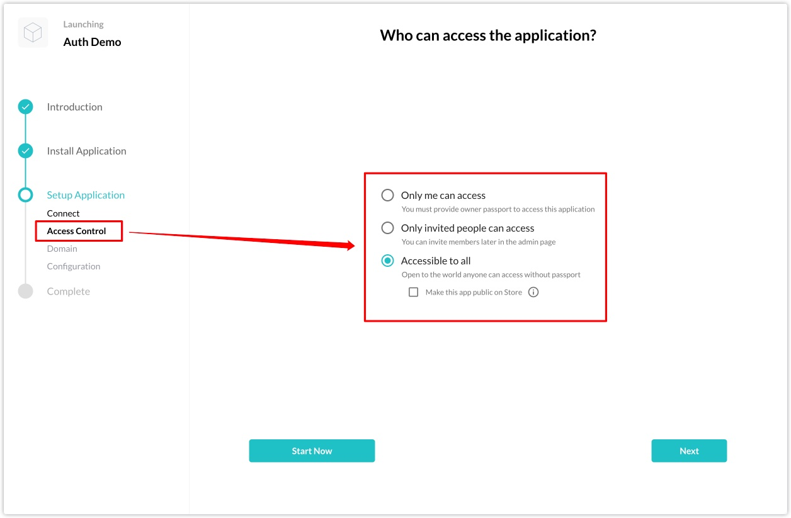

The authentication service is a convenient privilege management service provided by Blocklet Server to Blocklets, and any Blocklet in Blocklet Server can use the authentication service without any configuration.

For example, when installing the Auth Demo in Blocklet Store (Dev), you can select the following three authentication modes in the "Access Control" step of the "Setup Application".

- Only I can access
- Only the invitee's people can access
- Everyone can access

For more detailed documentation, please see [here](https://docs.arcblock.io/abtnode/en/developer/service-auth)
