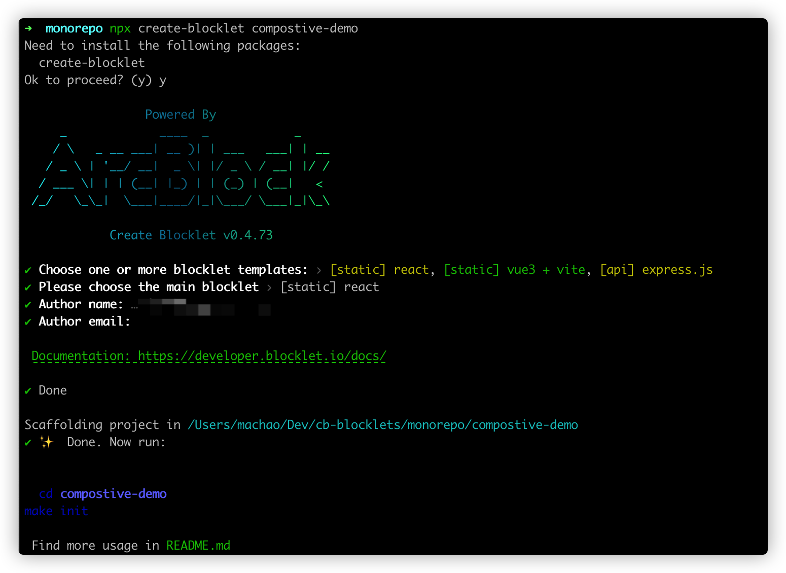
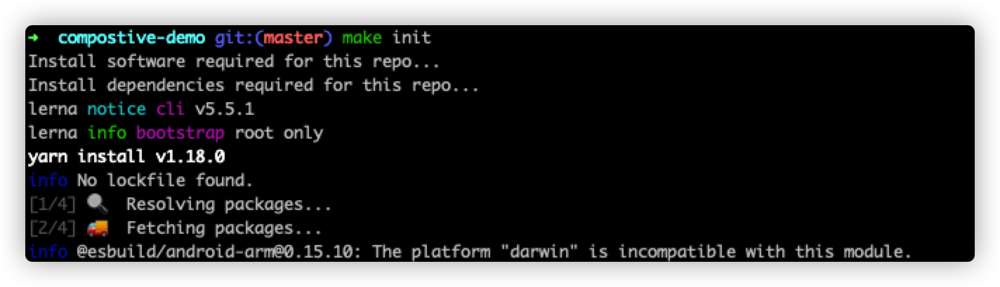
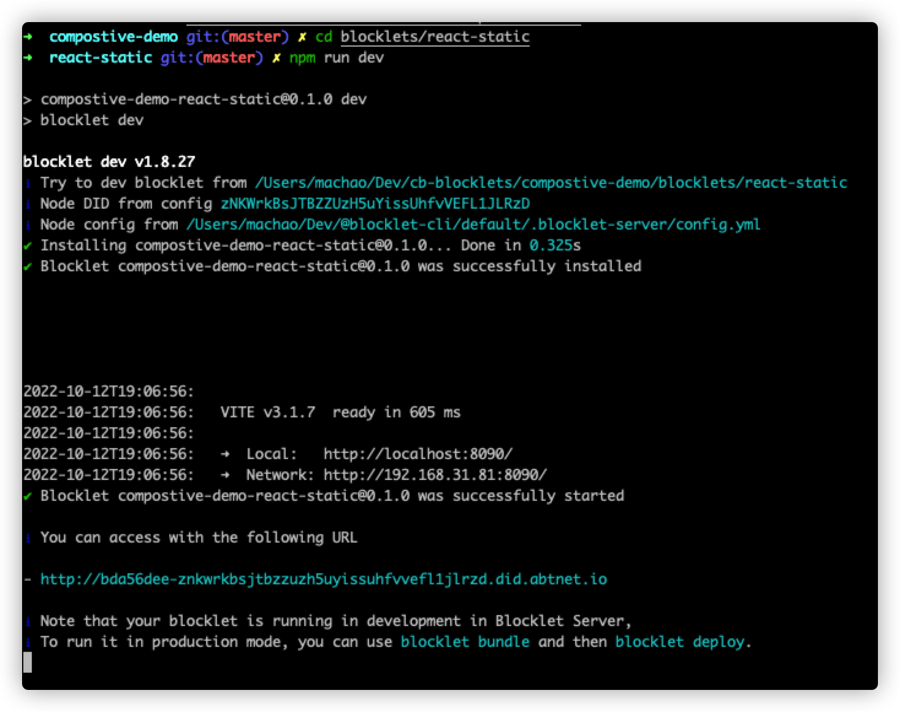
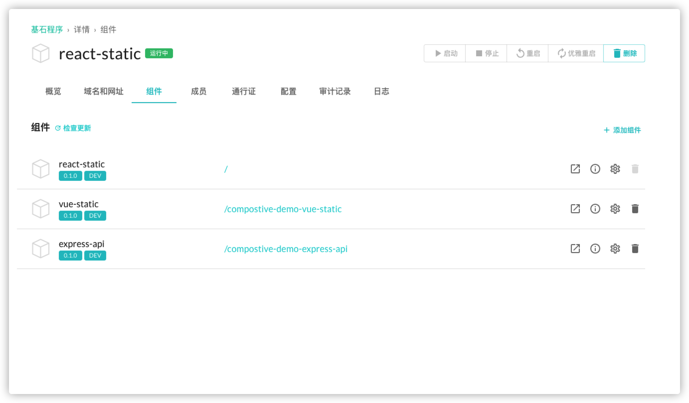
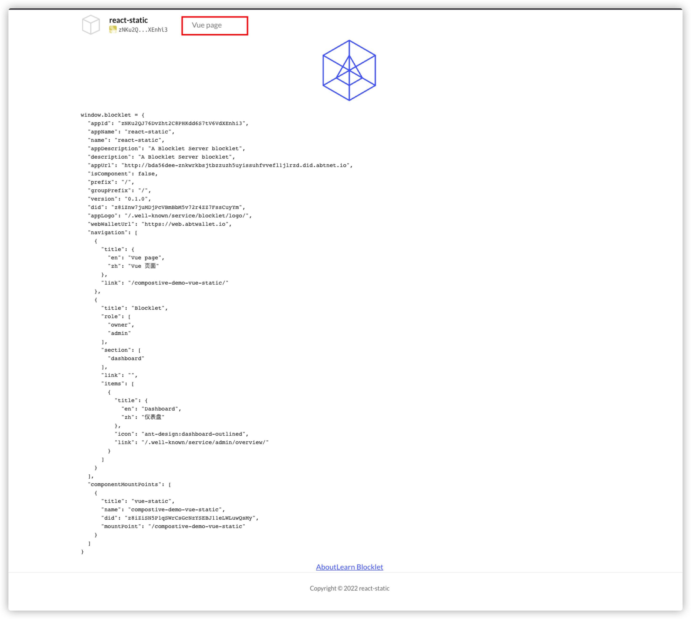
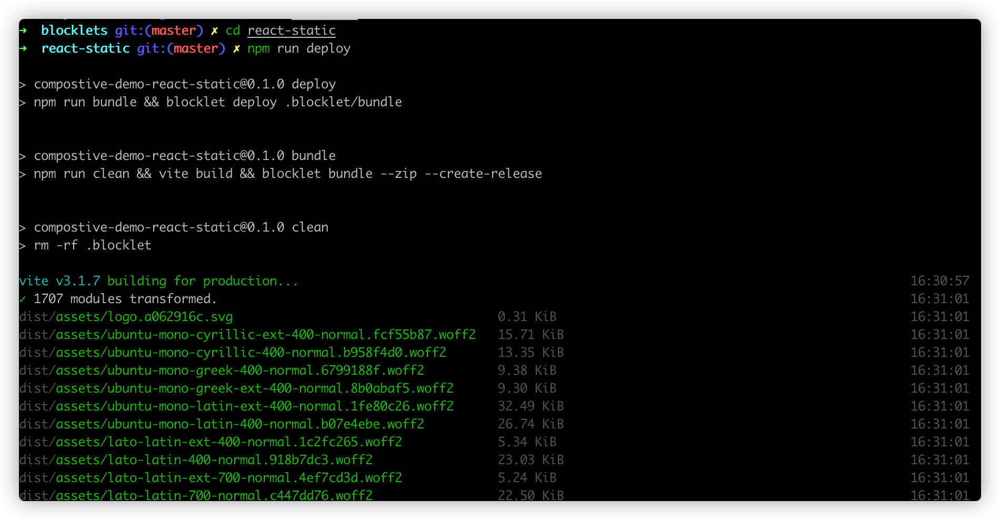
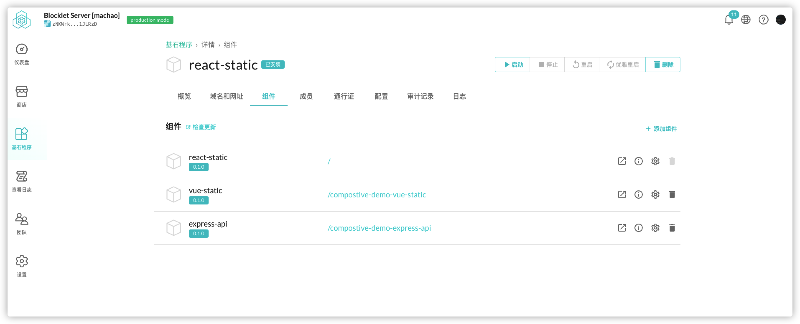

## What is a Combined Application

Thanks to the capabilities provided by the [Blocklet Development Platform](https://developer.blocklet.io/docs/zh), we can combine multiple `Blocklets` together, each `Blocklet` being both an application and a component. Each `Blocklet` can be combined by other `Blocklets`, and can also combine other `Blocklets`.

In a combined `Blocklet`, each component is a separate service, and they make you feel like you are using a complete application through a unified configuration and UI.

Our `create-blocklet` also provides the ability to quickly create combinatorial `Blocklet` seed projects.

## Creating Monorepo

`create-blocklet` enables the ability to develop combinatorial `Blocklets` by putting multiple `Blocklet` projects together for management by means of [monorepo](https://en.wikipedia.org/wiki/Monorepo).

After executing the `create-blocklet` command in the terminal and entering the project name to enter the template selection phase, we choose multiple templates, here we choose `react-dapp` `vue-static` `express` (with the ability of the `blocklet` platform, we can combine different front-end frameworks together).


Select a project as the main application, here we choose `react` as the main application


Enter the email, author, and other information and press enter to confirm. After waiting for the file to be created, we get a `Monorepo` type project directory containing the three `Blocklets` I chose in the previous step.



## Start the main application

Following the prompts in the terminal, we go to the root of the project and execute `make init` to install the dependencies needed for the project.


Go to the main application directory in `blocklets` and execute the `npm run dev` command to start the main application in development mode



## Start the child application

When the main application is successfully launched, execute the `npm run dev:child` command in the other blocklets directory in turn to mount the other blocklets to the main application.

In the administration page of your local blocklet-server instance, we can visualize the mounting relationship between blocklets: react-static as the main app, vue-static, express-api as children mounted on the main app


## Update the navigation of the portfolio application

> The application's navigation will be displayed in the page

Configure `navigation` in the application's `blocklet.yml`

```yml
navigation:
  - title:
      en: Vue page
      zh: Vue 页面
    link: /compostive-demo-vue-static
```

Remember the [unified configuration and UI] we mentioned at the beginning of the article (#what is a portfolio app)? We do this by using a unified UI component in each application's page for the configuration in `navigation`, which we show in a `react` type application using `@blocklet/ui-react`.

First install `@blocklet/ui-react` in the main application, and use `@blocklet/ui-react/lib/Header`, `@blocklet/ui-react/lib/Foote`r to transform the home page

```jsx
// compostive-demo/blocklets/react-static/src/components/layout.jsx
import PropTypes from 'prop-types';
import Header from '@blocklet/ui-react/lib/Header';
import Footer from '@blocklet/ui-react/lib/Footer';

function Layout({ children }) {
  return (
    <div>
      <Header />
      {children}
      <Footer />
    </div>
  );
}
Layout.propTypes = {
  children: PropTypes.any.isRequired,
};

export default Layout;
```

```jsx
// compostive-demo/blocklets/react-static/src/pages/home.jsx
import { Link } from 'react-router-dom';
import Layout from '../components/layout';

import logo from '../logo.svg';

function Home() {
  return (
    <Layout>
      
      <pre style={{ textAlign: 'left' }}>
        <code>window.blocklet = {JSON.stringify(window.blocklet, null, 2)}</code>
      </pre>
      <Link className="app-link" to="/about">
        About
      </Link>
      <a className="app-link" href="https://docs.arcblock.io/abtnode/" target="_blank" rel="noopener noreferrer">
        Learn Blocklet
      </a>
    </Layout>
  );
}

export default Home;
```

After the modification, you will see the following page on the home page: the `navigation` we just configured is displayed in the navigation bar of the coming page

At this point, you can access our `dev` `vue` sub-application by clicking `vue page`


## Deploying a blocklet application

When development is complete, you can deploy the application to the `blocklet server` using the `blocklet deploy` command;

The `monorepo` project created with the `create-blocklet` tool has `npm script` automatically configured for each `blocklet`, you just need to run `npm run deploy` to package your blocklet and deploy it to the local running `blocklet- server` instance

First deploy the main application : go to the directory where the main application is located, then run `npm run deploy`



Then deploy the children in turn: go to the directory where the other children are, and then run `npm run deploy:child`



For more information about the `blocklet deploy` command, please refer to [here](https://developer.blocklet.io/docs/zh/how-to/deploy)
