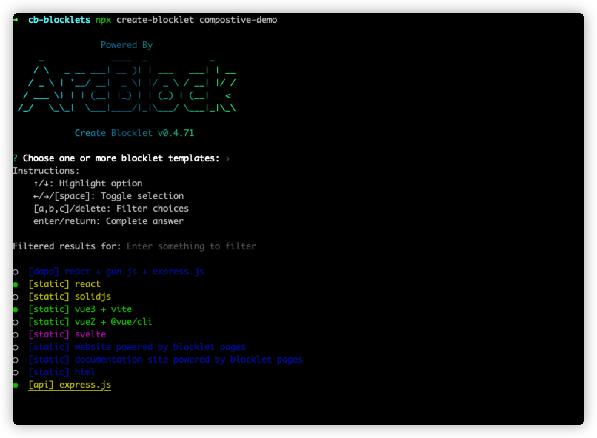
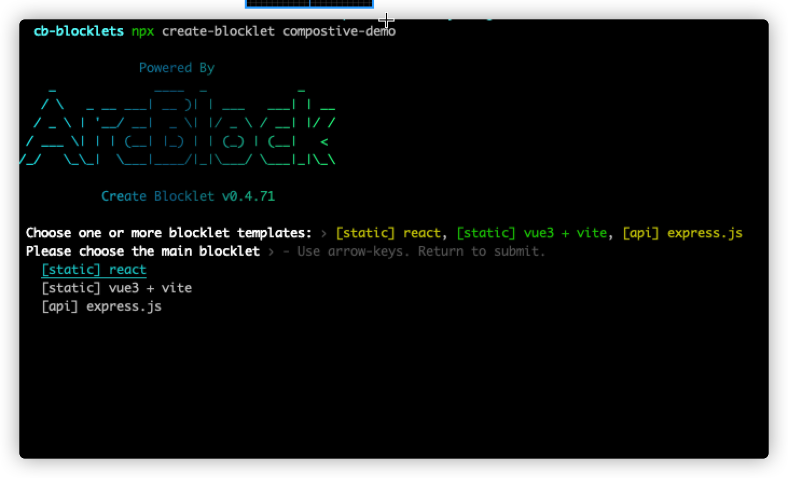
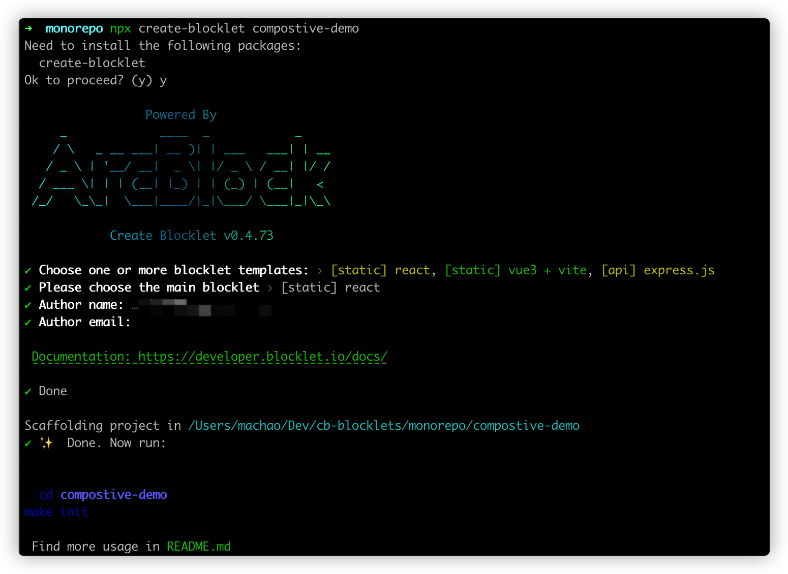
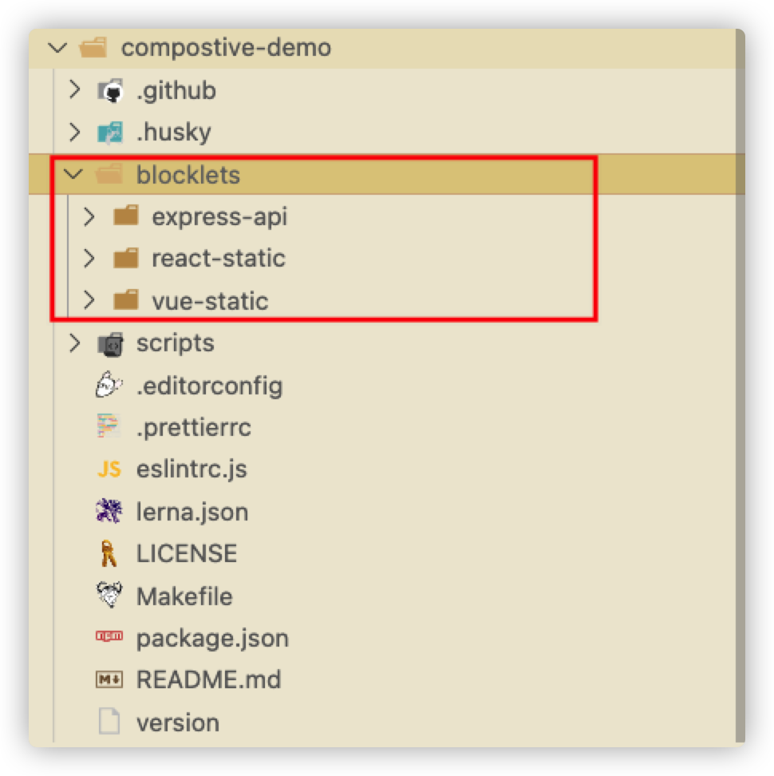
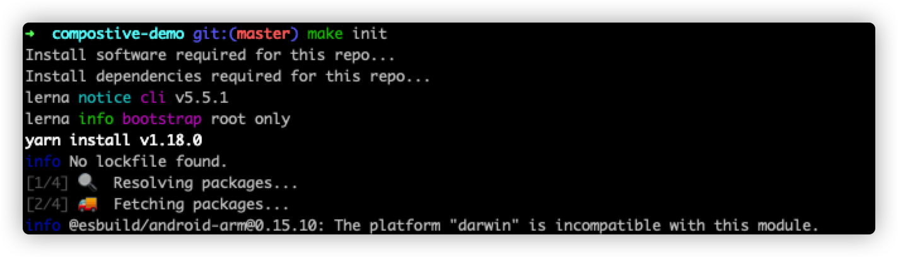
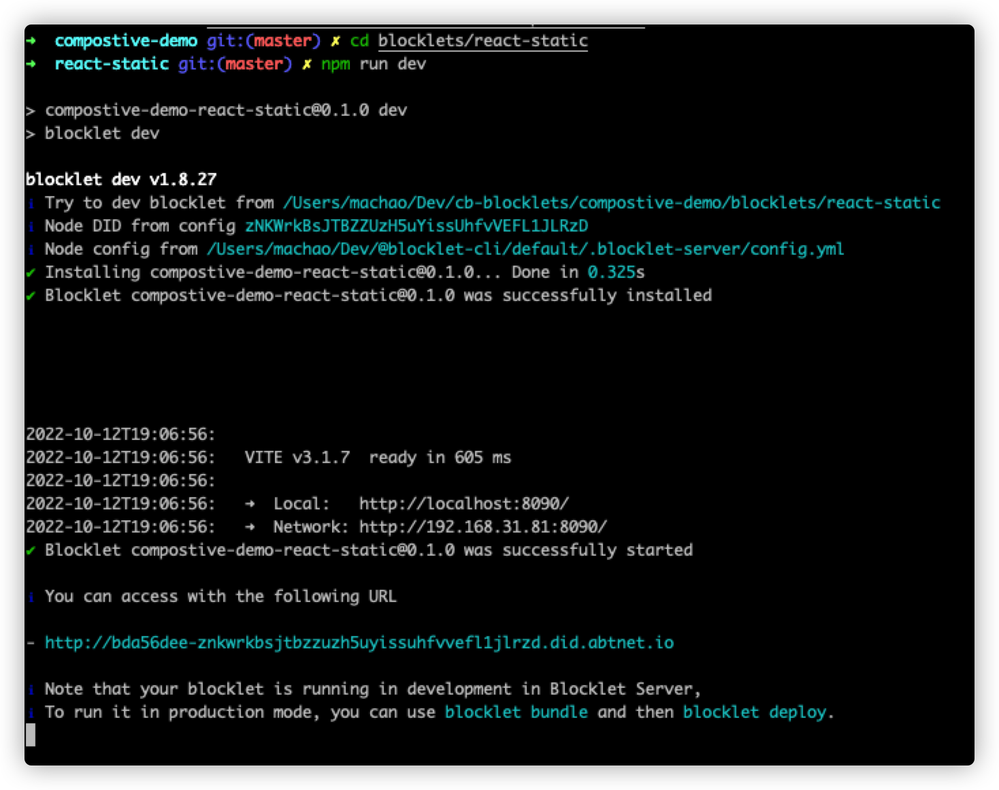
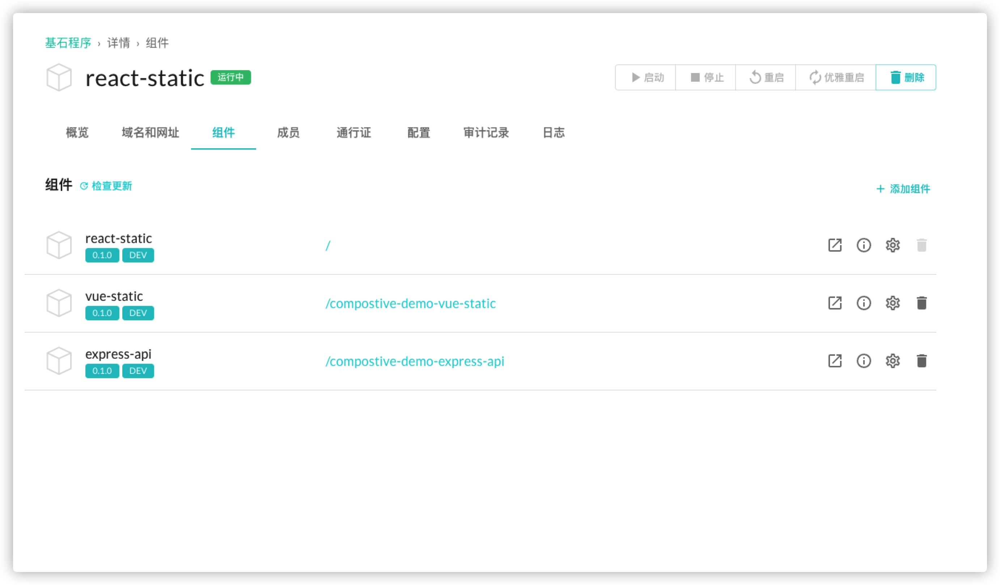
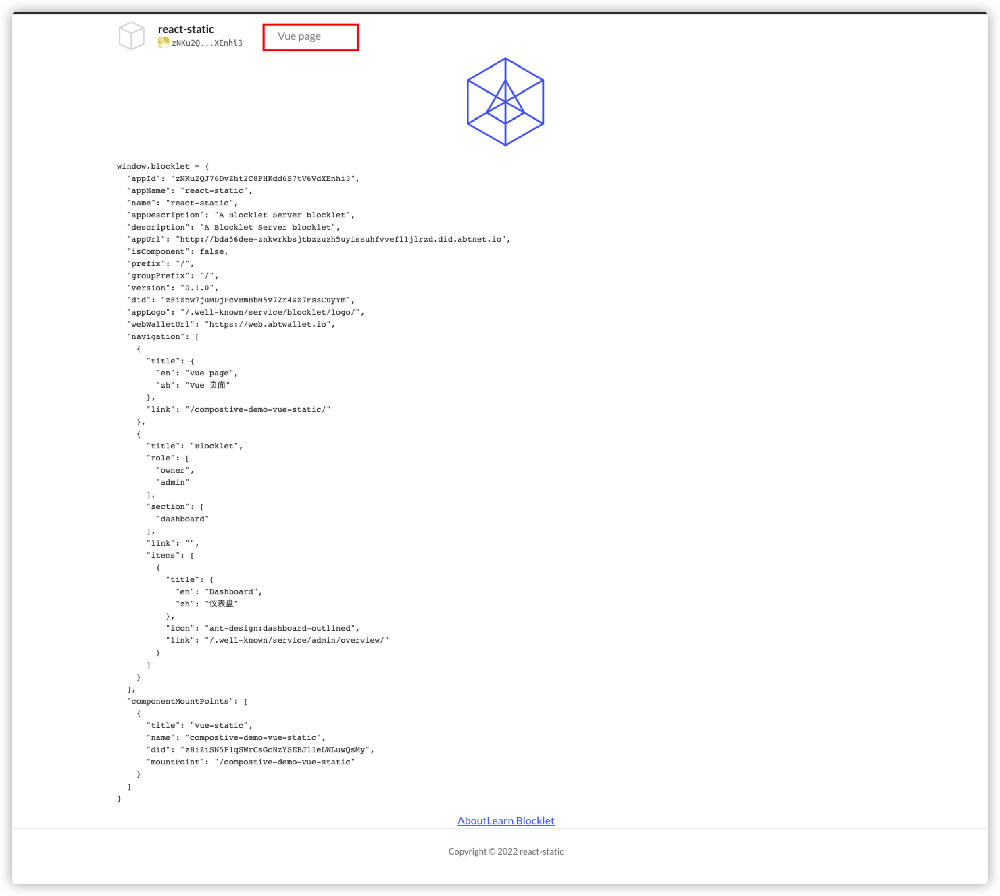
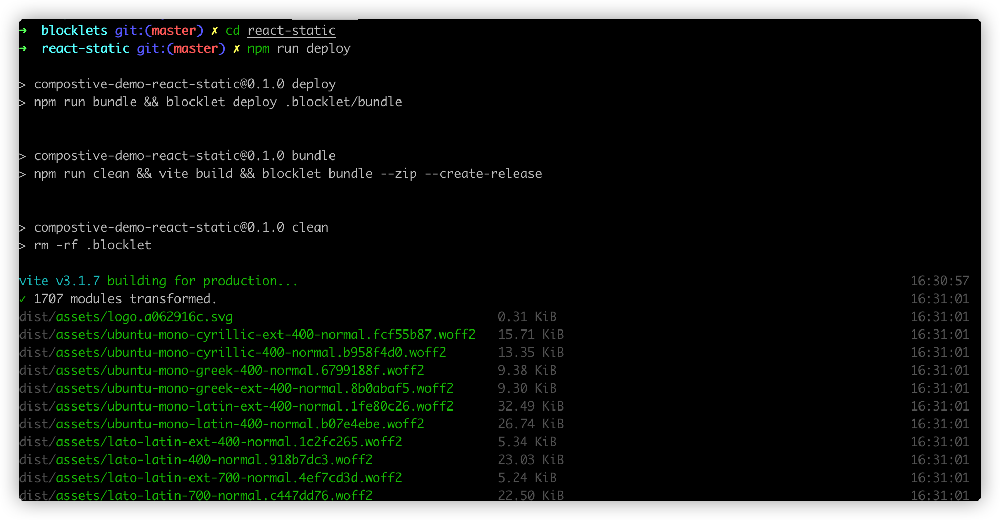
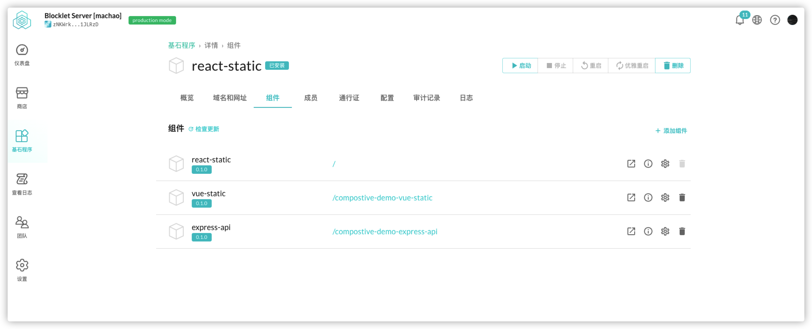

## 什么是组合应用

得益于 [Blocklet 开发平台](https://developer.blocklet.io/docs/zh) 提供的能力，我们可以将多个 `Blocklet` 组合在一起，每一个 `Blocklet` 既是应用，也是组件。 每一个 `Blocklet` 都可以被其他的 `Blocklet` 组合，也可以组合其他的 `Blocklet`.

组合在一起的 `Blocklet` 中，每一个组件是一个单独的服务，它们通过统一的配置和 UI, 使你感觉像在使用一个完整的应用。

我们的 `create-blocklet` 也提供了快速创建组合型 `Blocklet` 种子项目的能力。

## 创建 Monorepo

`create-blocklet` 通过 [monorepo](https://en.wikipedia.org/wiki/Monorepo) 的方式将多个 `Blocklet` 项目放在一起进行管理，从而实现开发组合型 `Blocklet` 的能力。

在终端中执行 `create-blocklet` 命令，输入项目名称后即可进入选择模板阶段后，我们选择多个模板，这里我们选择 `react-dapp` `vue-static` `express` 三种模板（借助 `blocklet` 平台的能力，我们可以将不同的前端框架组合在一起使用）。


选择一个项目作为主应用，这里我们选择 `react` 作为主应用


输入邮箱、作者、等信息后按键盘回车确认，等待创建文件后，我们便得到一个 `Monorepo` 类型的工程目录，里面含有上一步中我选择的三种 `Blocklet`。



## 启动主应用

根据终端中的提示，我们进入项目根目录，执行 `make init` 安装项目需要的依赖；


进入 `blocklets` 中的主应用目录，执行 `npm run dev` 命令，以开发模式启动主应用



## 启动子应用

当主应用启动成功后，依次在其他 blocklet 目录中执行 `npm run dev:child` 命令，将其他 blocklet 挂载到主应用上；

在你本地的 blocklet-server 实例的管理页面中，我们可以查看直观的看到 blocklet 之间的挂载关系： react-static 作为主应用，vue-static、express-api 作为子应用挂载在主应用上


## 更新组合应用的 navigation

> 应用的 navigation 会显示在页面中

在应用的 `blocklet.yml` 中配置 `navigation`

```yml
navigation:
  - title:
      en: Vue page
      zh: Vue 页面
    link: /compostive-demo-vue-static
```

还记得文章开头我们提到的 [统一的配置和 UI](#什么是组合应用) 吗？我们通过在各个应用的页面中使用统一的 UI 组件来 `navigation` 中的配置，在 `react` 类型的应用中我们使用`@blocklet/ui-react`来展示。

首先在主应用中安装 `@blocklet/ui-react`, 并使用 `@blocklet/ui-react/lib/Header` 、`@blocklet/ui-react/lib/Foote`r 对首页进行改造

```jsx
// compostive-demo/blocklets/react-static/src/components/layout.jsx
import PropTypes from 'prop-types';
import Header from '@blocklet/ui-react/lib/Header';
import Footer from '@blocklet/ui-react/lib/Footer';

function Layout({ children }) {
  return (
    <div>
      <Header />
      {children}
      <Footer />
    </div>
  );
}
Layout.propTypes = {
  children: PropTypes.any.isRequired,
};

export default Layout;
```

```jsx
// compostive-demo/blocklets/react-static/src/pages/home.jsx
import { Link } from 'react-router-dom';
import Layout from '../components/layout';

import logo from '../logo.svg';

function Home() {
  return (
    <Layout>
      
      <pre style={{ textAlign: 'left' }}>
        <code>window.blocklet = {JSON.stringify(window.blocklet, null, 2)}</code>
      </pre>
      <Link className="app-link" to="/about">
        About
      </Link>
      <a className="app-link" href="https://docs.arcblock.io/abtnode/" target="_blank" rel="noopener noreferrer">
        Learn Blocklet
      </a>
    </Layout>
  );
}

export default Home;
```

修改完成后，你将在首页看到如下页面：我们刚刚配置的 `navigation` 展示在来页面的导航栏中

此时点击 `vue page` 就可以访问到我们 `dev` 的 `vue` 子应用


## 部署组合型应用

当开发完毕，你可以使用 `blocklet deploy` 命令将应用部署到 `blocklet server`;

通过 `create-blocklet` 工具创建出来的 `monorepo` 项目，已经为每个 `blocklet` 自动配置好了 `npm script`, 你只需要执行 `npm run deploy` 即可将你的 blocklet 打包并部署到本地正在运行的 `blocklet-server` 实例中

首先部署主应用 : 进入主应用所在的目录，然后执行 `npm run deploy`



然后依次部署子应用: 进入其他子应用所在的目录，然后执行 `npm run deploy:child`



想了解关于更多 `blocklet deploy` 命令的信息，请参考[这里](https://developer.blocklet.io/docs/zh/how-to/deploy)
