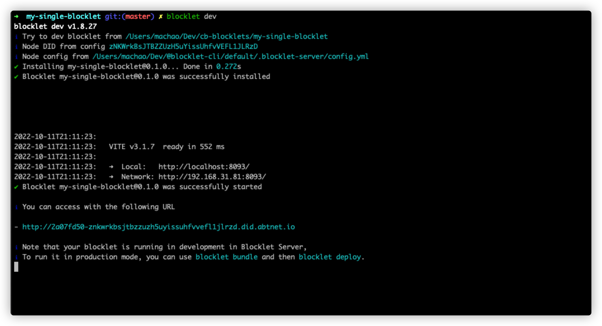

`create-blocklet` supports two creation modes, `create single application` and `combined application` of type `monorepo

## Creating a single application

The `create-blocklet` command allows you to enter the project name and enter the template selection stage, where you can enter keywords to search.

For more information about `blocklet` templates, please refer to [blocklet types](https://developer.blocklet.io/docs/zh/how-to/create)


Next we choose `[static] react` as an example

The program will automatically create the directory structure of the corresponding template and install the dependencies according to its prompts to enter the development mode of the project (provided that the [blocklet-server](https://developer.blocklet.io/docs/zh/quick-start/blocklet) environment is installed locally). -server) environment).

```shell
cd my-single-blocklet
npm install
blocklet dev
```

## Start the application

If your `blocklet dev` executes successfully, the terminal will output a `blocklet` application launch address, and you can see the currently launched `blocklet` by clicking on it and visiting it in your browser.




## Update and preview the application

At this point your `blocklet` is in development run mode, so you can debug the application in the browser while you develop. Next we modify the code in the project by adding the h2 title `Home Page` to `home.jsx`, which will automatically change the content on the page after saving


## Package and publish the application

When development is complete, your `blocklet` can be packaged using the `blocklet bundle` command provided in `@blocklet/cli`.

```json
  "scripts": {
    "dev": "blocklet dev",
    "eject": "vite eject",
    "serve": "vite preview",
    "lint": "eslint src --ext .mjs,.js,.jsx,.ts,.tsx",
    "lint:fix": "npm run lint -- --fix",
    "start": "vite --host",
    "clean": "rm -rf .blocklet",
    "bundle": "npm run clean && vite build && blocklet bundle --zip --create-release",
    "deploy": "npm run bundle && blocklet deploy .blocklet/bundle",
    "upload": "npm run bundle && blocklet upload .blocklet/release/blocklet.json",
    "prepare": "husky install"
  },
```

The project created with the `create-blocklet` tool is automatically configured with the `npm script`, you just need to run `npm run bundle` to package your `blocklet`


Next you can upload your `Blocklet` to the `blocklet-store` with the `blocklet upload` command , [detailed documentation here](https://developer.blocklet.io/docs/zh/how-to/publish)

Click on the following links for more information about `@blocklet/cli` and `blocklet-store`

- [blocklet-store](https://store.blocklet.dev/pages/zh/)
- [@blocklet/cli](https://developer.blocklet.io/docs/en/reference/blocklet-cli)
