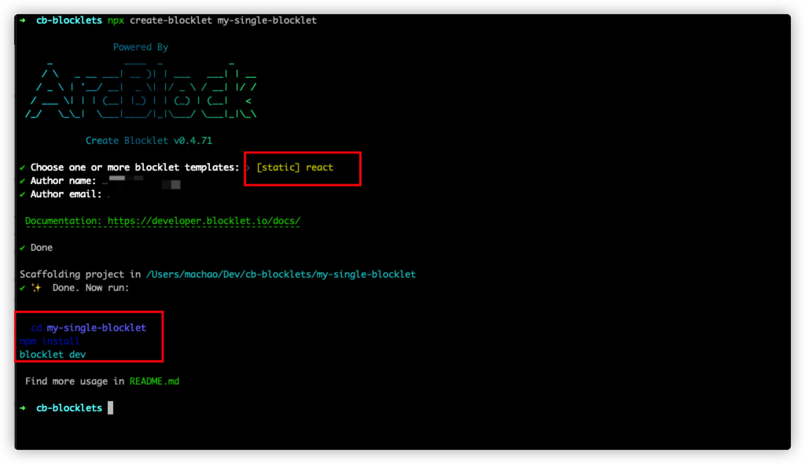
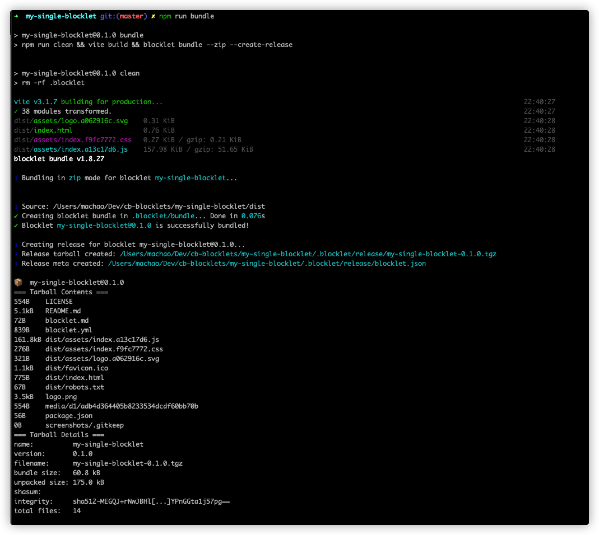

`create-blocklet` 支持两种创建模式，分别是`创建单个应用` 和创建 `monorepo 类型的`组合应用

## 创建单个应用

通过 `create-blocklet` 命令创建，输入项目名称后即可进入选择模板阶段，在这个页面中可以输入关键字进行搜索。

想了解关于更多 `blocklet` 模板的信息，请参考 [blocklet 类型](https://developer.blocklet.io/docs/zh/how-to/create)


接下来我们选择 `[static] react` 作为示例

程序会自动创建好对应模板的目录结构，根据其提示的信息进行依赖的安装即可进入项目的开发模式（前提在本机中有安装 [blocklet-server](https://developer.blocklet.io/docs/zh/quick-start/blocklet-server) 环境）。

```shell
cd my-single-blocklet
npm install
blocklet dev
```

## 启动应用

如果你上面的 `blocklet dev` 执行成功的话，终端里会输出一个 `blocklet` 的应用的启动地址,点击后在浏览器中访问就能看到当前启动的 `blocklet` 了。


## 更新和预览应用

这时你的 `blocklet` 处于开发运行的模式，你可以一边开发一边在浏览器中调试应用。接下来我们修改项目中的代码，向 `home.jsx` 中添加 h2 标题 `Home Page`，保存后页面上的内容将自动发生更改


## 打包和发布应用

当开发工作完成后，通过 `@blocklet/cli` 中提供的 `blocklet bundle`命令，可以将你的 `blocklet` 打包。

```json
  "scripts": {
    "dev": "blocklet dev",
    "eject": "vite eject",
    "serve": "vite preview",
    "lint": "eslint src --ext .mjs,.js,.jsx,.ts,.tsx",
    "lint:fix": "npm run lint -- --fix",
    "start": "vite --host",
    "clean": "rm -rf .blocklet",
    "bundle": "npm run clean && vite build && blocklet bundle --zip --create-release",
    "deploy": "npm run bundle && blocklet deploy .blocklet/bundle",
    "upload": "npm run bundle && blocklet upload .blocklet/release/blocklet.json",
    "prepare": "husky install"
  },
```

通过 `create-blocklet` 工具创建出来的项目，已经自动配置好了 `npm script`, 你只需要执行 `npm run bundle` 即可将你的 `blocklet` 打包



接下来你可以通过 `blocklet upload` 命令将你的 `blocklet` 上传到 `blocklet-store` 中 , [详细文档在这里](https://developer.blocklet.io/docs/zh/how-to/publish)

点击下面链接了解关于更多 `@blocklet/cli` 和 `blocklet-store` 的信息

- [blocklet-store](https://registry.arcblock.io/pages/zh/)
- [@blocklet/cli](https://developer.blocklet.io/docs/en/reference/blocklet-cli)
