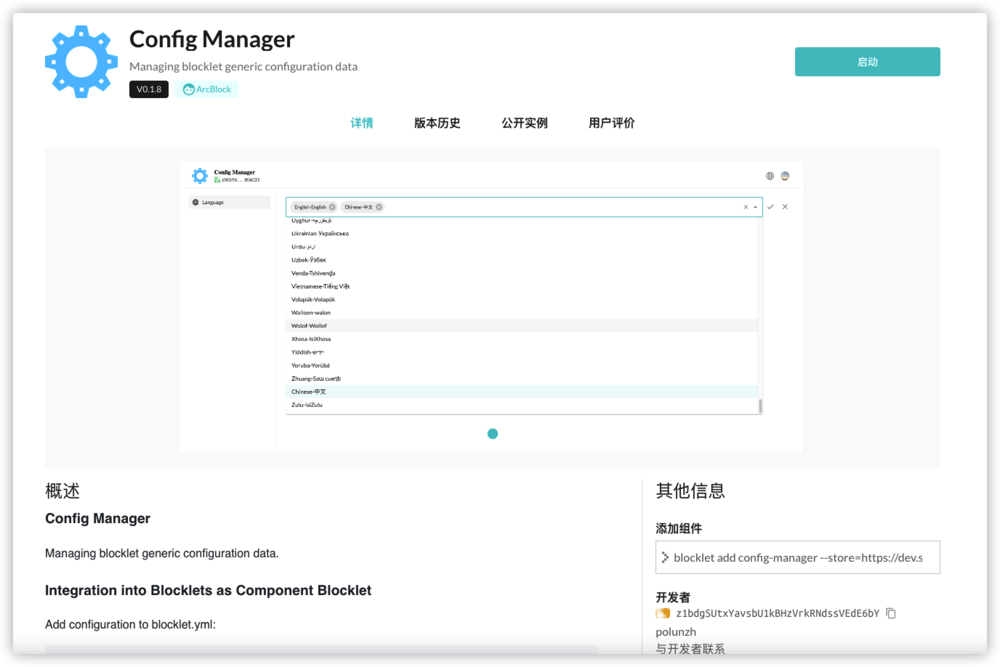

在每个 `Blocklet` 应用的根目录中都存在一个 `blocklet.yml` 文件，它是 `Blocklet` 应用的配置文件，包括项目的名称、版本、作者、项目的描述等配置信息。

下面介绍如何通过修改 `blocklet.yml` 在定义你的应用

## 配置 blocklet 的名称和描述

```shell
title: Example APP
description: Demo blocklet that shows how to configure Blocklet Meta
```
`Blocklet` 名称和描述通过 `title` 和 `description` 表示。

`title` 和 `description` 将呈现在页面中，对用户可见。

## 配置 blocklet 的 logo

> 注意: logo 的宽高比须相同，尺寸不能小于 256px * 256px

```shell
logo: logo.png
```

## 配置 blocklet.md 文件

`blocklet.md` 专用于描述 `Blocklet` 应用的文件，在上传 `Blocklet` 至 `blocklet-store` 后，会将该文件作为 `Blocklet` 应用的描述文件。

## 配置 screenshots 

`screenshots` 是 `Blocklet` 应用的图片文件夹，用于上传至 `blocklet-store` 后，在 `blocklet-store` 的详情页中显示。

我们需要在 `blocklet.yml` 中配置 `screenshots` 字段，指定 `Blocklet` 应用的图片文件夹的路径。

```shell
screenshots:
  - 0.png
  - 1.png
  - 2.png
```

一个经过配置后的 `Blocklet` 展示在 `blocklet-store` 中样子




更多的配置见 [Blocklet Meta: Infomation](https://developer.blocklet.io/docs/zh/reference/blocklet-spec#infomation)
