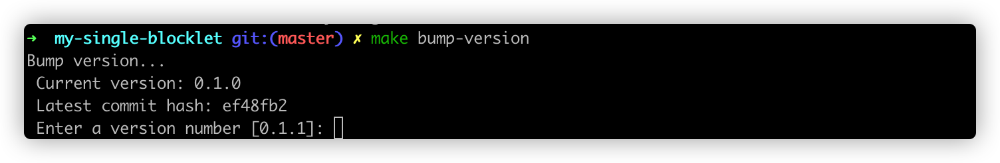
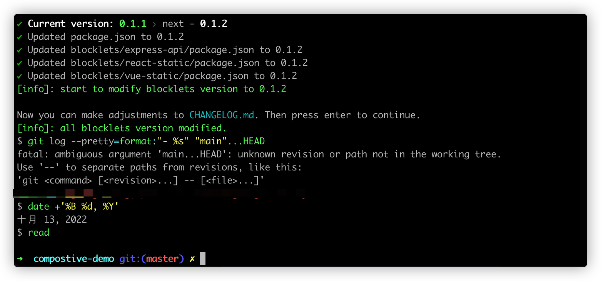

The project created by the `create-blocklet` tool is automatically configured with the corresponding versioning script

## Versioning in a single application project

Execute `make bump-version ` in the root directory, the script will automatically calculate the next version number, or you can choose to enter the specified version number by typing enter.

Follow the prompts in the terminal to adjust the CHANGELOG.md file, continue typing enter and end.

This completes the update of the single application project version

## Versioning in a combined application project

Run `npm run bump-version` in the root directory, select a version update method, and type enter.

Follow the prompts in the terminal to adjust the CHANGELOG.md file, continue typing enter, and finish.

This completes the update of the composition application version
