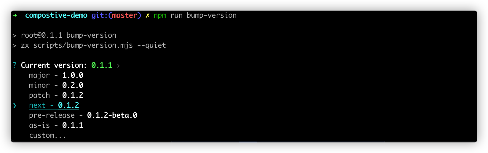

通过 `create-blocklet` 工具创建出来的项目，已经自动配置好了对应的版本管理脚本

## 单个应用项目中的版本管理

根目录中执行 `make bump-version`，脚本会自动计算出下一个版本号，你也可以选择输入指定的版本号，键入回车；

按照终端中的提示对 CHANGELOG.md 文件进行调整，继续键入回车，结束；

这样就完成了对单个应用项目版本的更新

## 组合型应用项目中的版本管理

根目录中执行 `npm run bump-version`, 选择一种版本号更新方式，键入回车；

按照终端中的提示对 CHANGELOG.md 文件进行调整，继续键入回车，结束；

这样就完成了对组合型应用版本的更新
