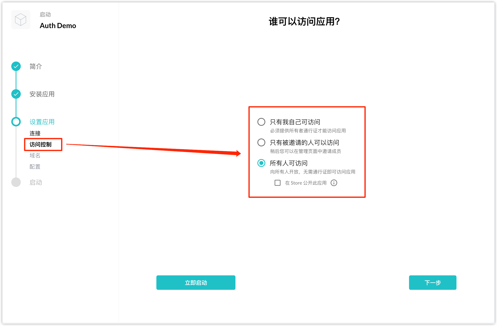

认证服务是 Blocklet Server 提供给 Blocklet 的一种便捷的权限管理服务，在 Blocklet Server 中的任意一个 Blocklet，都可以在无需任何配置的情况下使用到认证服务。

例如在安装 Blocklet Store (Dev) 中的 Auth Demo 时，可以在“设置应用”的步骤中的“访问控制”选择以下三种认证模式：

- 只有我自己可以访问
- 只有被邀请人的人可以访问
- 所有人可以访问

更详细的文档请查看[这里](https://developer.blocklet.io/docs/zh/how-to/auth)
