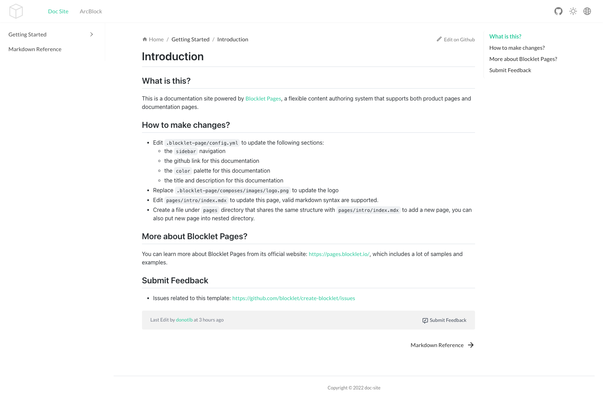

<TemplateCoverImage>
  
</TemplateCoverImage>

<TemplateInfo info={{ 
  name: 'doc-site', 
  blockletType: 'static',
  composable: 'Yes',
  framework: 'xmark', 
  languages: 'JavaScript',
  useCase: 'Documentation / Website', 
  author:'ZhangHan',
}} />

该模板是一个由 xmark 驱动的文档站骨架，可以用于构建项目文档站点。

## 开发

:::Alert
需要准备 Blocklet Server 环境.
:::

```shell
npm install # install dependencies
blocklet dev # start dev
```


## 技术栈

- React 18
- React Router 6
- CRA 5
- CRACO 6.x

## 参考

- [可用脚本](/available-scripts)
