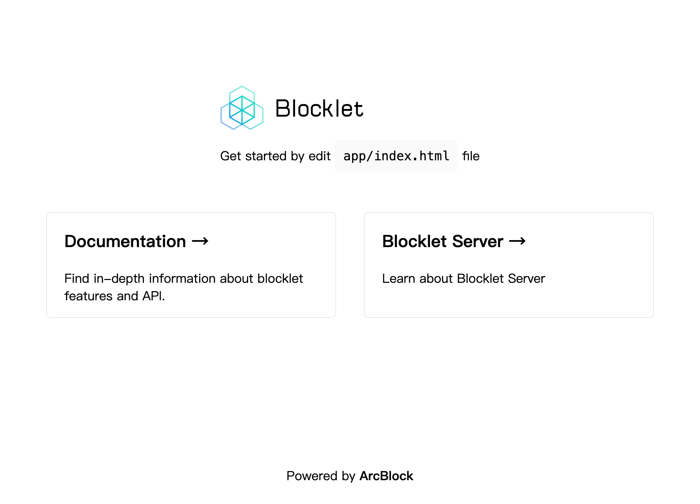

<TemplateCoverImage>
  
</TemplateCoverImage>

<TemplateInfo info={{ 
  name: 'html-static', 
  blockletType: 'static',
  composable: 'Yes',
  languages: 'HTML',
  useCase: 'Starter', 
  author:'ZhangHan',
  readme: 'https://github.com/blocklet/create-blocklet/blob/main/packages/create-app/templates/html-static/README.md',
}} />

该模板是一个最简单的 HTML 静态页面应用。可以用于将已有的静态网页程序包装成 Blocklet。

## 开发

:::Alert
需要准备 Blocklet Server 环境.
:::

```shell
# install dependencies
npm install
# run the blocklet in development environment mode
blocklet dev
```

网页程序代码存放于 app 目录中，包括 logo、css 样式、html 等文件，你可以尝试编辑 html 和 css 文件，然后刷新页面查看修改后的效果。

## 参考

- [在本机启动 Blocklet Server](https://developer.blocklet.io/docs/en/prerequisites/server)
- [可用脚本](/available-scripts)
- [目录结构](/folder-structure)
