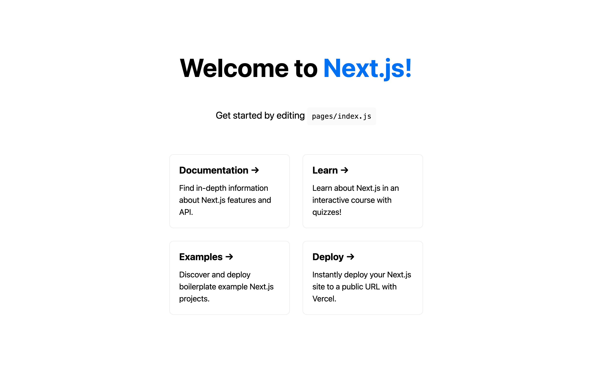

<TemplateCoverImage>
  
</TemplateCoverImage>

<TemplateInfo info={{ 
  name: 'nextjs-dapp', 
  blockletType: 'dapp',
  composable: 'Yes',
  languages: 'JavaScript',
  useCase: 'Starter', 
  author:'ZhangHan',
  readme: 'https://github.com/blocklet/create-blocklet/blob/main/packages/create-app/templates/nextjs-dapp/README.md',
}} />

该模板是一个基于 Next.js 构建的 Dapp 应用骨架。

## 开发

:::Alert
需要准备 Blocklet Server 环境.
:::

```shell
# install dependencies
npm install
# run the blocklet in development environment mode
blocklet dev
```

应用包含前端和服务端两个部分，分别对应 api 和 pages 目录，你可以尝试编辑 api 目录或 pages 目录中的模块，然后刷新页面查看修改后的效果。

## 技术栈

- React 18
- Next.js
- Express

## 参考

- [在本机启动 Blocklet Server](https://developer.blocklet.io/docs/en/prerequisites/server)
- [可用脚本](/available-scripts)
- [目录结构](/folder-structure)
