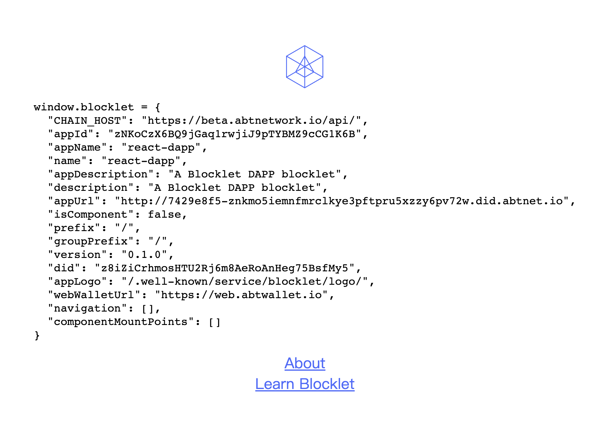

DescDescDescDescDescDescDesc

- Blocklet Type: Static
- Composable: Yes
- React	Framework: React
- Languages: JavaScript	
- Use Case: Starter
- Author: ZH				

## 开发

:::Alert
需要准备 Blocklet Server 环境.
:::

```shell
npm install # install dependencies
blocklet dev # start dev
```


## 技术栈

- React 18
- React Router 6
- CRA 5
- CRACO 6.x

## 参考

- [可用脚本](/available-scripts)
