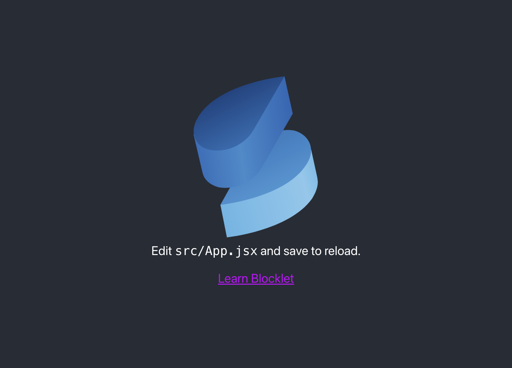

<TemplateCoverImage>
  
</TemplateCoverImage>

<TemplateInfo info={{ 
  name: 'solidjs-dapp', 
  blockletType: 'dapp',
  composable: 'Yes',
  languages: 'JavaScript',
  useCase: 'Starter', 
  author:'ZhangHan',
  readme: 'https://github.com/blocklet/create-blocklet/blob/main/packages/create-app/templates/solidjs-dapp/README.md',
}} />

该模板是一个基于 SolidJS 构建的 Dapp 应用骨架。

## 开发

:::Alert
需要准备 Blocklet Server 环境.
:::

```shell
# install dependencies
npm install
# run the blocklet in development environment mode
blocklet dev
```

应用代码主要存放于以下几个目录中:  

- api 目录: 存放服务端接口模块
- src 目录: 存放 SolidJS 前端应用相关模块

你可以尝试编辑目录中的模块，然后刷新页面查看修改后的效果。

## 技术栈

- SolidJS
- Vite
- Express
- axios

## 参考

- [在本机启动 Blocklet Server](https://developer.blocklet.io/docs/en/prerequisites/server)
- [可用脚本](/available-scripts)
- [目录结构](/folder-structure)
